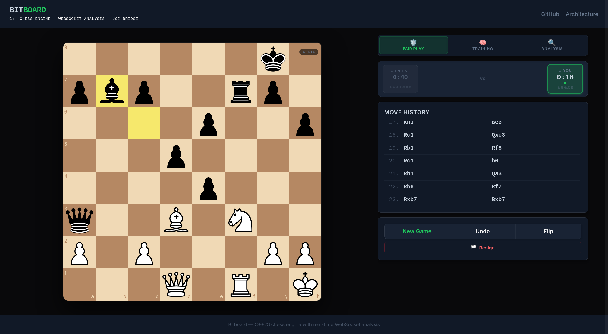
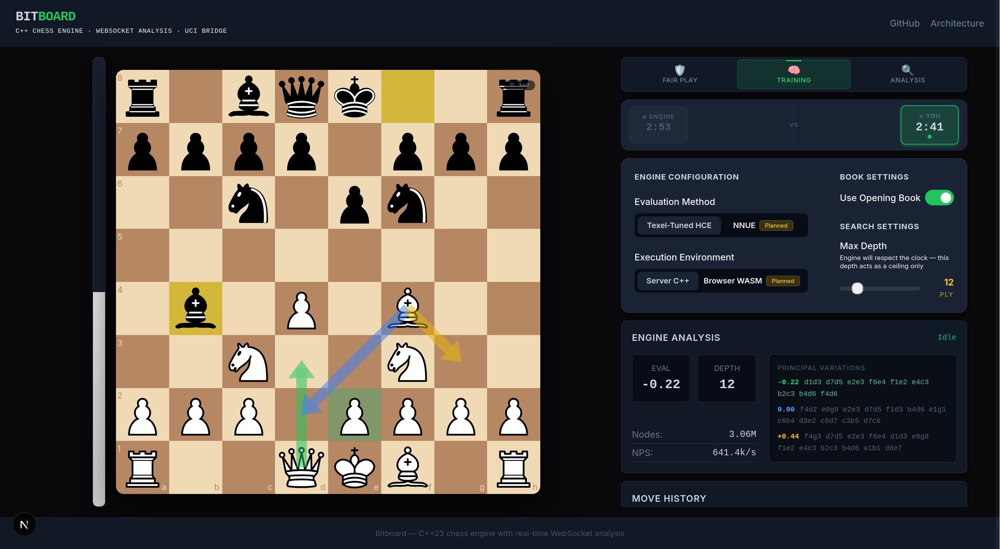
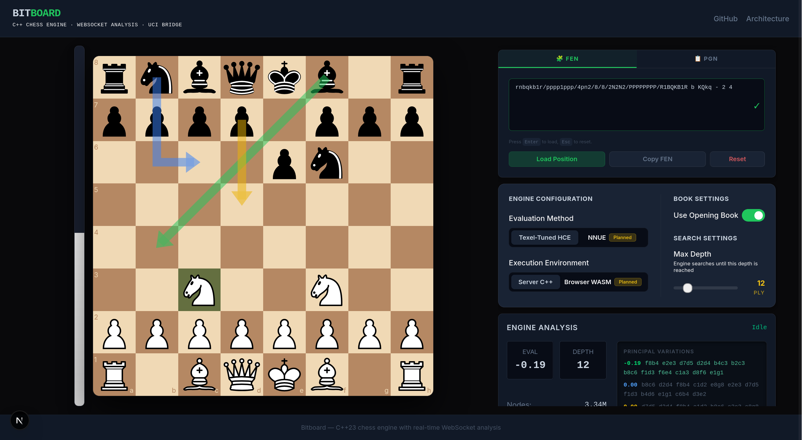

# Bitboard Chess Engine

A highly-optimized, custom C++23 bitboard chess engine paired with a modern, real-time web analysis platform built in Next.js and Node.js. 

**Live Demo:** [https://bitboard.ksohail.space/](https://bitboard.ksohail.space/)
## Screenshots

<table>
  <tr>
    <td width="33.33%" align="center">
      
    </td>
    <td width="33.33%" align="center">
      
    </td>
    <td width="33.33%" align="center">
      
    </td>
  </tr>
  <tr>
    <td align="center"><strong>Fair Play Mode</strong></td>
    <td align="center"><strong>Training Mode</strong></td>
    <td align="center"><strong>Analysis Mode</strong></td>
  </tr>
</table>

## Overview

Bitboard is a comprehensive, full-stack chess engineering project. Rather than using an off-the-shelf engine like Stockfish, this project implements a custom UCI-compliant chess engine from scratch in C++23. The engine is connected to an elegant "engine room" web dashboard, allowing players to challenge the bot or deeply analyze specific positions using real-time WebSockets streaming.

## Features

- **Three distinct modes**:
  - **Fair Play:** Play against the engine under standard time controls with no assistance.
  - **Training:** Play with live engine evaluation, depth, and principal variation (PV) overlays.
  - **Analysis:** Setup arbitrary FENs or import PGNs for continuous, unrestricted engine analysis.
- **Custom C++23 Engine:** Blazing fast bitboard representations and Negamax search framework.
- **Real-Time Streaming:** Live telemetry of Nodes, Nodes Per Second (NPS), Depth, and Eval over WebSockets.
- **UCI Protocol Bridge:** A scalable Node.js session manager gracefully multiplexes isolated engine processes for browser clients.
- **Dynamic FEN / PGN Handling:** Copy, paste, and load complex game states on the fly.

## Tech Stack

- **Engine:** C++23, standard library (no external dependencies)
- **Frontend:** Next.js, React, TypeScript, Tailwind CSS, Recharts
- **Backend Bridge:** Node.js, WebSockets (`ws`), `child_process`
- **Deployment:** Docker, Docker Compose, Nginx

## Architecture Summary

The platform uses a decoupled three-tier architecture:

1. **Next.js Frontend:** Manages the board state (`chess.js`), user interface, and WebSocket connectivity.
2. **Node.js Session Manager:** Spawns and manages isolated C++ UCI processes per connection, translating JSON websocket messages into standard UCI standard input/output.
3. **C++ Chess Engine:** Processes positions and streams iterative deepening evaluations.


For a deep-dive into the technical implementation, please read the [Architecture Documentation](docs/ARCHITECTURE.md).

## Engine Internals

The custom chess AI was built for performance and accuracy:
- **Bitboards:** Core state is modeled using 64-bit integers and bitwise operations for efficient piece attack generation and board queries.
- **Search Pipeline:** Alpha-beta pruned Negamax search integrated with Iterative Deepening.
- **Transposition Tables:** Zobrist hashing caches visited node evaluations to prevent redundant tree traversal.
- **Move Ordering:** MVV-LVA, Killer Move heuristics, and History tables drastically improve alpha-beta cutoff rates.
- **Quiescence Search:** Extended horizon search to resolve noisy tactical captures.
- **Evaluation:** Hand-Crafted Evaluation (HCE) optimized via Texel Tuning.

The engine includes a compact opening-book binary at `engine/openings/performance.bin`, which is required for opening-book support. Larger/generated books are intentionally excluded from the repository.

## Web Platform

The UI is built with a dark, technical "engine room" aesthetic. It utilizes React state to smoothly display asynchronous multi-variation payloads streaming from the engine in real-time. 


## Local Setup

### Prerequisites
- Node.js (v18+)
- Make & GCC/Clang (for compiling C++23)

### Verify the repository

Run all engine, frontend, backend, protocol, and production-build checks:

```bash
make verify
```

Focused verification targets are also available:

```bash
make verify-engine
make verify-website
```

### Manual Run

1. **Compile the engine:**
   ```bash
   cd engine
   make all
   ```
2. **Install frontend/backend dependencies:**
   ```bash
   cd ../website
   npm install
   ```
3. **Start the development stack (Next.js + WebSocket Server):**
   ```bash
   npm run dev:all
   ```
4. Access the application at `http://localhost:3000` unless you changed
   `FRONTEND_PORT`.

The default application ports are:

```dotenv
FRONTEND_PORT=3000
BACKEND_PORT=3001
```

Local npm commands load these from `website/.env.local` and the usual Next.js
mode files: `.env`, `.env.local`, `.env.development`,
`.env.development.local`, `.env.production`, and `.env.production.local`.
Shell values win over env files. For one launched process, `PORT` is an
explicit override; otherwise frontend/full-stack modes use `FRONTEND_PORT` and
backend-only modes use `BACKEND_PORT`.

```text
dev:frontend      -> FRONTEND_PORT
dev:full          -> FRONTEND_PORT
start:frontend    -> FRONTEND_PORT
start             -> FRONTEND_PORT
start:full        -> FRONTEND_PORT
start:server      -> FRONTEND_PORT (alias for start:full)

dev:backend       -> BACKEND_PORT
start:backend     -> BACKEND_PORT
```

```bash
FRONTEND_PORT=3100 npm run dev:frontend
BACKEND_PORT=3101 npm run dev:backend
```

For local production, build the website and start the complete same-origin
application:

```bash
cd website
npm run build
FRONTEND_PORT=3050 ENGINE_PATH=../engine/chess-engine npm start
```

`npm start` is an alias for `start:full`; it runs the compiled custom server,
serves the Next.js frontend, and handles `/api/engine` WebSocket upgrades on
the same public origin. `npm run start:frontend` starts only the standalone
Next.js frontend and is intended for split/reverse-proxy deployments where
`/api/engine` is routed to a backend service externally. `npm run
start:backend` starts only the WebSocket/engine service.

Engine settings shown in the web UI are sent through the page's active engine
session. They persist across `ucinewgame` in the current page session and are
reapplied when the page reconnects to a new engine process.

Training Mode supports three opponent-strength profiles: Blitz (`go movetime
1000`), Standard (`go movetime 3000`), and Deep (`go depth 8`). These profiles
only affect opponent move selection. Training feedback uses separate review
searches so move grading is not weakened by the selected opponent difficulty.
If the engine connection is lost during Training, in-flight review/search work
is invalidated; reconnect resumes from the current board turn instead of
reusing an unknown old request.

## Docker Setup

The project provides a production-ready containerized pipeline.

1. Create a `.env` file in the `./deploy/` directory (refer to `docker-compose.yml` for required variables).
2. Build and spin up the stack:
   ```bash
   docker compose -f deploy/docker-compose.yml up -d --build
   ```

To run the Docker stack on non-default ports:

```bash
FRONTEND_PORT=8180 BACKEND_PORT=8181 \
docker compose -f deploy/docker-compose.yml up -d --build
```

Docker Compose loads deployment values from `deploy/.env`. `FRONTEND_PORT`
configures the frontend container listener and nginx-proxy upstream port.
`BACKEND_PORT` configures the backend container listener, health check, and
nginx-proxy upstream port. The nginx public ports stay fixed at 80 and 443, and
SSH stays fixed at 22 outside this application configuration. Browser
WebSockets stay same-origin on `/api/engine`; no backend port is exposed to
frontend JavaScript.

## Project Structure

```
.
├── engine/              # C++23 Engine Source Code
│   ├── src/             # Core headers and cpp implementations
│   └── Makefile         # Compilation script
├── website/             # Full-Stack Web Platform
│   ├── src/app/         # Next.js Pages & Layouts
│   ├── src/components/  # React UI Components
│   ├── src/hooks/       # Custom React Hooks (e.g. useEngine)
│   ├── src/lib/         # Node.js backend logic (WebSocket, UCI bridge)
│   └── server.ts        # Custom Node/Next bootstrapper
├── docs/                # Architecture and media assets
└── deploy/              # Dockerfiles and CI/CD bash scripts
```

## Roadmap

- Implement WASM compilation for client-side engine execution.
- Add an NNUE (Efficiently Updatable Neural Network) evaluation pipeline.
- Expand endgame tablebase support.
