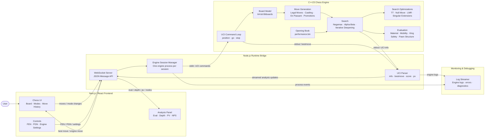

# Architecture Overview

The Bitboard project is a full-stack chess analysis platform. It seamlessly integrates a high-performance, custom-built C++23 chess engine with a modern web frontend via a Node.js WebSocket bridge. This architecture ensures low-latency, real-time evaluation streaming directly to the browser.

## High-Level System Design

## Core Components

### 1. Web Platform (Next.js / React)
The frontend is built with **Next.js**, **React**, and **TypeScript**, styled elegantly with **Tailwind CSS**. It provides three primary interaction modes:
- **Fair Play**: Standard time-controlled play against the engine without access to live analysis metrics.
- **Training**: Play against the engine with real-time PV (Principal Variation), Depth, Nodes, and Evaluation feedback.
- **Analysis**: Unrestricted board setup, FEN/PGN importing, and continuous deep-search analysis of arbitrary positions.

The frontend relies on `chess.js` for legal move generation, PGN parsing, and local FEN tracking. All heavy computational lifting is deferred to the backend.

### 2. Node.js Engine Session Manager
To maintain process isolation and multiplexing, a custom **WebSocket JSON protocol** bridges the browser to the engine. The Node.js server maintains an `EngineSessionManager` that:
- Spawns a dedicated, isolated C++ child process (`child_process.spawn`) per active client.
- Translates the JSON WebSocket commands (e.g., `{"type": "analyze", "fen": "..."}`) into standard **UCI (Universal Chess Interface)** text commands.
- Listens to engine `stdout`, parsing dense UCI `info` lines to extract Depth, Eval, NPS, Nodes, and MultiPV variations.
- Streams structured, debounced JSON packets back to the client.
- Implements robust teardown logic to prevent orphan processes when connections drop or sessions expire.

### 3. C++23 Bitboard Chess Engine
At the core of the platform is a standalone, from-scratch chess engine written in modern **C++23**. 

#### Board Representation
The engine leverages **Bitboards**—representing the presence of specific piece types on specific squares using 64-bit integers (`uint64_t`). This architecture allows for lightning-fast move generation, attack masks, and piece queries using bitwise operators (`&`, `|`, `^`, `<<`, `>>`) and hardware intrinsic instructions like `popcount`.

#### Search & Evaluation Pipeline
- **Negamax Framework**: The engine utilizes an alpha-beta pruned Negamax search algorithm.
- **Iterative Deepening**: The search iteratively probes deeper into the game tree, maintaining a real-time `bestmove` across varying time controls.
- **Transposition Table**: Utilizing Zobrist Hashing to cache and retrieve evaluations for previously visited board states, avoiding redundant sub-tree traversals.
- **Move Ordering**: Advanced heuristics (e.g., MVV-LVA, Killer Moves, History Heuristics) drastically reduce the branching factor by forcing the alpha-beta algorithm to evaluate promising moves earlier.
- **Quiescence Search**: An extended tactical search applied at the leaves of the depth horizon to resolve noisy tactical sequences (e.g., chains of captures) before returning a static evaluation.
- **Static Evaluation**: Hand-Crafted Evaluation (HCE) tuned using the Texel tuning method to mathematically optimize piece-square tables and material values.

## Deployment Architecture

The application is containerized using Docker and managed via Docker Compose.
- **`chess-frontend`**: The statically built/optimized Next.js web application.
- **`chess-backend`**: The Node.js server paired alongside the pre-compiled C++ engine binary.
- **Proxy**: Nginx or a lightweight reverse proxy terminates SSL (Let's Encrypt) and handles WebSocket (`Upgrade: websocket`) routing.
